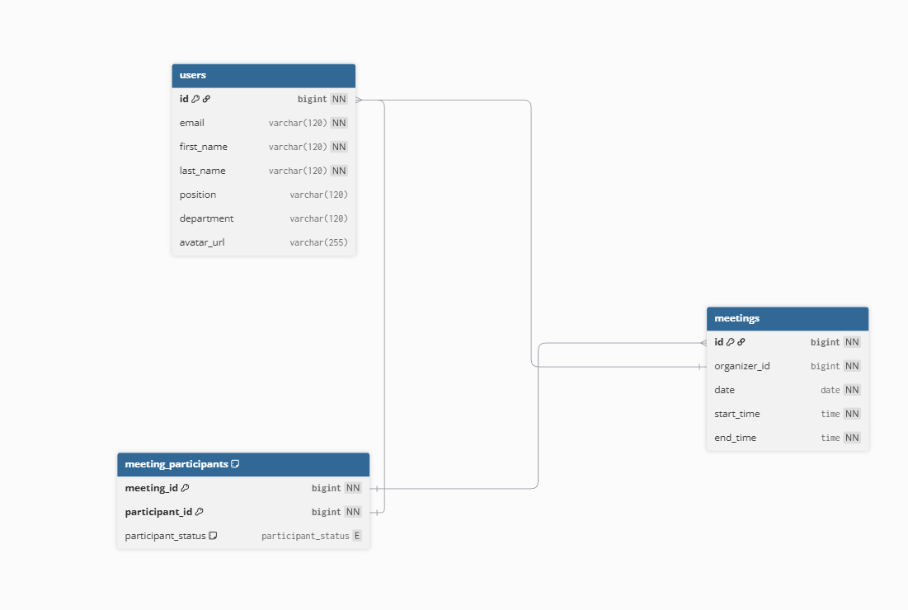

# Техническое задание на разработку программного продукта для планирования встреч
## Команда: Чёрный ящик

## User stories
### Story 1 - Регистрация
Как сотрудник, я хочу зарегестрироваться в приложении для того, чтобы пользоваться его функционалом

### Story 2 - Вход в учетную запись
Как сотрудник, я хочу иметь возможность входить в свой аккаунт для использования функций приложения

### Story 3 - Редактирование профиля

Как сотрудник, я хочу иметь возможность просматривать и редактировать свой профиль для того, чтобы мои данные были корректными и актуальными

### Story 4 - Создание встреч
Как сотрудник, я хочу иметь возможность создавать встречи с приглашенными участниками для организации рабочих обсуждений

### Story 5 - Просмотр календаря
Как сотрудник, я хочу иметь возможность просматривать расписание с запланированными и прошедшими встречами, чтобы планировать свое рабочее время

### Story 6 - Управление приглашениями
Как сотрудник, я хочу иметь возможность принимать и отклонять приглашения для других пользователей для управления своим участием во встречах

## Use cases

### Case 1 - Регистрация

**Предусловия:** У пользователя нет аккаунта.
**Основной сценарий:**
1. Пользователь открывает экран входа.
2. Пользователь переключается на регистрацию.
3. Пользователь вводит свой email, пароль, ФИО.
4. Пользователь нажимает "Зарегистрироваться".
5. Сервер валидирует данные, создает аккаунт, возвращает токены.
6. Пользователь получает токены и перенаправляется на главный экран.

**Альтернативный сценарий:** Пользователь с таким email существует, пользователь информируется об этом.
**Постусловия:** Аккаунт создан, пользователь находится на главной странице приложения.

### Case 2 - Вход в аккаунт

**Предусловия:** У пользователя есть аккаунт
**Основной сценарий:**
1. Пользователь открывает экран входа.
2. Пользователь входит email и пароль.
3. Пользователь нажимает "Войти".
4. Сервер валидирует полученные данные и выдает токены.
5. Пользователь получает токен и перенаправляется на главный экран.

**Альтернативный сценарий:** Аккаунт с введенным email не существует/пароль неверный - пользователь получает сообщение об ошибке.
**Постусловия:** Пользователь имеет токены для доступа к приложению.

### Case 3 - Редактирование профиля

**Предусловия:** У пользователя есть аккаунт и он вошел в приложение.

**Основной сценарий:**
1. Пользователь открывает страницу профиля.
2. Пользователь нажимает "Редактировать".
3. Пользователь вносит изменения в данные.
4. Пользователь сохраняет сделанные изменения.
5. Сервер проверяет данные и подтверждает их обновление.

**Альтернативный сценарий:**
- Один из введенных данных недействителен или не уникален: пользователь получает сообщение об ошибке и рекомендацию по исправлению.
- Пользователь отменяет изменения: ничего не происходит, данные остаются без изменений.

**Постусловия:** Информация пользователя обновлена в системе, а он возвращается на страницу профиля.

### Case 4 - Создание встречи

**Предусловия:** У пользователя есть учетная запись и он авторизован в приложении.

**Основной сценарий:**
1. Пользователь открывает приложение.
2. Пользователь нажимает кнопку "Создать встречу".
3. Пользователь заполняет информацию о встрече.
4. Пользователь подтверждает создание встречи.
5. Сервер добавляет встречу в базу данных и отправляет приглашения участникам.

**Альтернативный сценарий:**
- Обязательные поля для создания встречи не заполнены — сервер возвращает ошибку.
- Участника невозможно добавить (например, в случае отсутствия такого пользователя в системе) — пользователь получает сообщение об ошибке.

**Постусловия:** Встреча добавлена в календарь пользователя, приглашенный список участников оповещен.

### Case 5 - Просмотр календаря

**Предусловия:** У пользователя есть учетная запись и он авторизован.

**Основной сценарий:**
1. Пользователь открывает приложение.
2. Пользователь выбирает экран календаря.
3. Сервер возвращает список встреч пользователя.
4. Пользователь может выбрать встречу и получить более подробную информацию о ней.

**Альтернативный сценарий:**
- Если мероприятий нет, календарь остается пустым

**Постусловия:** Пользователь получает информацию о своем расписании.

### Case 6 - Управление приглашениями

**Предусловия:** У пользователя есть учетная запись и он авторизован.

**Основной сценарий:**
1. Пользователь получает уведомление о новом приглашении на встречу.
2. Пользователь переходит на страницу приглашений.
3. Пользователь видит список активных приглашений.
4. Пользователь выбирает приглашение и подтверждает или отклоняет его.
5. Сервер обновляет информацию о статусе приглашения (принято/отклонено), статусе участника на встрече, отправляет уведомление организатору встречи.

**Альтернативный сценарий:**
- Приглашение уже недействительно(например встреча уже прошла) — пользователь получает уведомление об этом.

**Постусловия:** Статус участия пользователя обновлен, соответствующие уведомления для организатора разосланы.

## Задачи для backend-разработки

### Для регистрации
1. **Разработка API для регистрации**:
    - POST запрос на создание нового аккаунта.
    - Валидация email, пароля и других данных.
    - Проверка уникальности email в базе данных.
    - Генерация токенов доступа.
    - Реакция на запросы с недействительными/некорректными данными (например, возврат ошибок с описанием проблемы).

### Для входа в учетную запись
1. **Разработка API для аутентификации**:
    - POST запрос с email и паролем.
    - Проверка существования пользователя в базе данных.
    - Хэширование пароля с использованием безопасного подхода.
    - Генерация токенов и их возврат.
    - Отправка сообщений об ошибке для недействительных данных (неверные учетные данные).

2. Реализовать систему авторизации

### Для редактирования профиля
1. **Разработка API для редактирования профиля**:
    - PUT/PATCH запрос для обновления профиля пользователя.
    - Валидация входных данных.
    - Обновление записей о пользователе в базе данных.

2. Добавить защиту изменения данных

### Для создания встреч
1. **Разработка API для создания встреч**:
    - POST запрос с данными о встрече
    - Проверка прав доступа.
    - Валидация данных.
    - Добавление сведений о встрече в базу данных.
    - Реализация отправки приглашений участникам

2. **Обновление методов API для работы с календарем**.

### Для просмотра календаря
1. **Разработка API для получения расписания**:
    - GET запрос для загрузки встреч конкретного пользователя.
    - Сортировка встреч по дате и времени.
    - Разделение встреч на запланированные и прошедшие.

### Для управления приглашениями
1. **Разработка API для работы с приглашениями**:
    - GET запрос на получение списка активных приглашений.
    - POST/PUT запросы для подтверждения или отклонения приглашений.
    - Оповещение организатора о принятии/отказе от участия.

2. Автоматическое обновление статуса встречи

## Схема базы данных

## 1. Общие описание
Необходимо разработать программный продукт для планирования встреч сотрудников внутри компании. Система состоит из клиентского мобильного приложения и серверной части.

## 2. Клиентская часть (Android-приложение)
Клиентом является **Android-приложение**, которое должно быть реализовано на **Kotlin** или **Java** с использованием **адаптивной верстки**.

Приложение должно предоставлять интуитивно понятный интерфейс, в котором реализован следующий функционал:

*   **Регистрация и авторизация** сотрудника.
*   **Настройка личного профиля**.
*   **Создание встречи** с возможностью приглашения других сотрудников. Приглашенные сотрудники должны иметь возможность дать бинарный ответ (**принял** / **не принял**).
*   **Просмотр списка активных приглашений** на встречи с возможностью дать ответ о возможности посещения.
*   **Просмотр собственного расписания встреч** в разрезе дня, недели и месяца.

**Важное условие:** временные слоты для встреч разбиты строго по часам. Например, можно создать встречу на 9:00–10:00, но создание встречи на 9:10, 9:05 и т.д. — невозможно.

## 3. Серверная часть
Сервер представляет собой **микросервис на Spring Boot**, работающий с СУБД **PostgreSQL** или **H2**.

Серверное приложение должно:
*   Предоставлять API, необходимый для полноценной работы мобильного приложения.
*   Осуществлять все основные операции с данными в базе через **Spring Data JPA**.
*   Использовать **Liquibase** для создания схемы базы данных и ее предзаполнения.